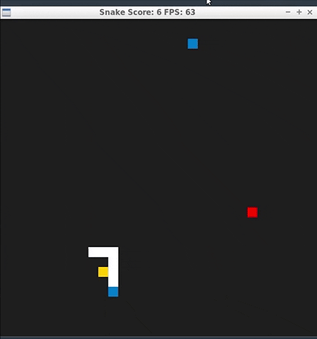

# CPPND: Capstone Snake Game Example

This is my Capstone project in the [Udacity C++ Nanodegree Program](https://www.udacity.com/course/c-plus-plus-nanodegree--nd213). The code for this repo was inspired by [this](https://codereview.stackexchange.com/questions/212296/snake-game-in-c-with-sdl) excellent StackOverflow post and set of responses.

As we can see in the GIF above, the two features I added were a "poison" block and a "diet pill" block. The poison block has the color of red and the diet pill has the color of blue. Whenever the snake hits the poison block, the game ends. Whenever the snake hits the the diet pill, the snake will shrink in size by 1 if the snake has a size larger than 1.  

Rubrics satisfied:
* Loops, Functions, I/O - "The project demonstrates an understanding of C++ functions and control structures."
	* the features added are packed into functions. A setter function "ShrinkBody" is added in snake class (snake.h, line 21) and its implementation is in line 81 of snake.cpp. Instances of control structures are implemented in snake.cpp's UpdateBody function (snake.cpp, line 51). When the snake hits a diet pill, its shrinking attribute is set to true. The size of the body vector needs to be reduced by 1 if the body size is larger than 2. However, if the body size is smaller equal to 2, the body size will not change, as the size of the snake cannot be negative. The "if else" for "shrinking" attribute is incorporated logically into the "if else" block of "growing" attribute in the starter code.

* Object Oriented Programming - "The project uses Object Oriented Programming techniques."
	* In game.h line 23 and 24, the poison and diet pill objects are private attributes of the game class. All added functionalities are packed into existing classes and member functions. New functions are added when necessary.

* Object Oriented Programming - "Classes use appropriate access specifiers for class members."
	* In snake.h line 39, boolean variable shrinking is declared as a private member of the class snake and its setter function ShrinkBody (line 21) is declared as a public function of the class. Other added class attributes are also declared either as public or private members.

* Object Oriented Programming - "Classes abstract implementation details from their interfaces."
	* all added functionalities are well documented with additional comments. For instance, in game.cpp's line 67, when placing food, poison and diet pill, a comment is added to explain how those 3 items cannot overlap with each other and also cannot coincide with snake's body. In snake.h's line 20, the functionality of the newly added function "ShrinkBody" is provide.

* Object Oriented Programming - "Classes encapsulate behavior."
	* in game.h's line 23 and 24, new attributes of the class game are added right after the original attribute food. In the new function "PlaceFoodPoisonDietpill" in game.cpp's line 53, poison's and diet pill's positions are generated right after food's position. In snake.cpp's line 81, public function ShrinkBody sets the value for the private member shrinking. Thus, all related data and functions are grouped together. Hidden members can only be accessed by member functions.

## Dependencies for Running Locally
* cmake >= 3.7
  * All OSes: [click here for installation instructions](https://cmake.org/install/)
* make >= 4.1 (Linux, Mac), 3.81 (Windows)
  * Linux: make is installed by default on most Linux distros
  * Mac: [install Xcode command line tools to get make](https://developer.apple.com/xcode/features/)
  * Windows: [Click here for installation instructions](http://gnuwin32.sourceforge.net/packages/make.htm)
* SDL2 >= 2.0
  * All installation instructions can be found [here](https://wiki.libsdl.org/Installation)
  >Note that for Linux, an `apt` or `apt-get` installation is preferred to building from source. 
* gcc/g++ >= 5.4
  * Linux: gcc / g++ is installed by default on most Linux distros
  * Mac: same deal as make - [install Xcode command line tools](https://developer.apple.com/xcode/features/)
  * Windows: recommend using [MinGW](http://www.mingw.org/)

## Basic Build Instructions

1. Clone this repo.
2. Make a build directory in the top level directory: `mkdir build && cd build`
3. Compile: `cmake .. && make`
4. Run it: `./SnakeGame`.

## CC Attribution-ShareAlike 4.0 International

Shield: [![CC BY-SA 4.0][cc-by-sa-shield]][cc-by-sa]

This work is licensed under a
[Creative Commons Attribution-ShareAlike 4.0 International License][cc-by-sa].

[![CC BY-SA 4.0][cc-by-sa-image]][cc-by-sa]

[cc-by-sa]: http://creativecommons.org/licenses/by-sa/4.0/
[cc-by-sa-image]: https://licensebuttons.net/l/by-sa/4.0/88x31.png
[cc-by-sa-shield]: https://img.shields.io/badge/License-CC%20BY--SA%204.0-lightgrey.svg